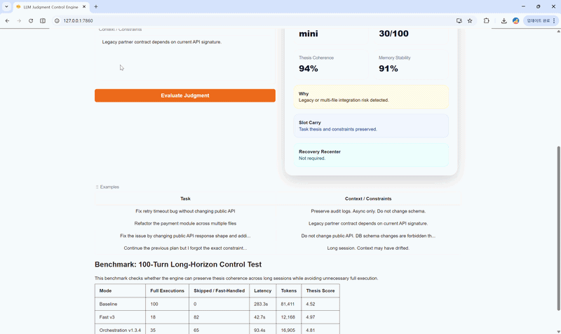

A runtime decision layer for LLMs.

# LLM Judgment Control Engine



Stop LLMs from drifting, forgetting context, hallucinating, over-executing, and wasting expensive model calls.

---

## 🔴 The Problem

LLMs in long sessions often fail in ways that are expensive and hard to notice.

They can:

* forget key context
* drift away from the original task
* hallucinate under uncertainty
* overuse expensive models
* continue after the workflow state is no longer trustworthy
* break integration constraints in coding workflows

Have you ever spent 40 minutes with an LLM before realizing it forgot the original task?

This project exists because of that.

---

## What This Engine Controls

| Failure Mode | What the Engine Does |
|---|---|
| Session reset | Carries core task slots across turns |
| Context drift | Detects thesis mismatch and triggers hold |
| Hallucination risk | Pauses or blocks execution under uncertainty |
| Expensive model overuse | Routes safe turns to lightweight models |
| Risky code changes | Blocks contract-breaking or destructive execution |
| Stale workflow state | Holds execution when verification is required |
| Runtime state risk | Holds or blocks execution when the workflow state is no longer trustworthy |
| Team integration friction | Preserves constraints, APIs, and project thesis before execution |

---

## 🎬 Demo 0 — System Overview

[Watch demo](assets/demo_overview.gif)

→ Runtime judgment layer before execution

---

## 🎬 Demo 1 — Dangerous Change (Block)

[Watch demo](assets/demo_block.gif)

→ Prevents breaking API / destructive execution

---

## 🎬 Demo 2 — Normal Execution (Commit)

[Watch demo](assets/demo_commit.gif)

→ Safe task proceeds with lightweight model

---

## 🎬 Demo 3 — Constraint-Aware Execution (Commit)

[Watch demo](assets/demo_commit2.gif)

→ Executes while preserving constraints and context

---

## 🎬 Demo 4 — Context Drift (Hold)

[Watch demo](assets/demo_hold.gif)

→ Pauses execution when context becomes unstable

---

## 🧠 Core Mechanism

```text
task → thesis check → slot carry → recovery recenter → risk gate → decision
```

The engine returns one of three decisions:

| Decision | Meaning |
|---|---|
| commit | Safe to proceed |
| hold | Needs verification or recentering |
| block | Unsafe, incoherent, or constraint-breaking |

---

## Memory Control

### Slot Carry

Important task anchors are carried across turns so the model does not lose key facts during long sessions.

Examples:

* original thesis
* user constraints
* prior decisions
* forbidden changes
* unresolved risks

### Recovery Recenter

When drift is detected, the engine recenters the workflow around the original task before continuing.

Instead of blindly generating the next answer, it asks:

```text
Are we still solving the same problem?
```

---

## Runtime Security

LLM workflows are vulnerable not only to bad prompts, but also to unstable or copied execution state.

This engine adds a lightweight runtime security layer that can help detect when an LLM workflow should no longer continue automatically.

It is designed to support:

* session integrity checks
* copied-session risk reduction
* replay-resistant workflow control
* permission-aware execution gates
* abnormal runtime condition handling
* safer long-running agent workflows

Security does not always mean blocking everything.

Sometimes the safest action is:

```text
hold → verify → recenter → continue
```

The engine treats security as part of judgment, not as a separate after-the-fact filter.

---

## Benchmark: 100-Turn Long-Horizon Control Test

This benchmark checks whether the engine can preserve thesis coherence across long sessions while avoiding unnecessary full execution.

| Mode | Full Executions | Skipped / Fast-Handled | Latency | Tokens | Thesis Score |
|---|---:|---:|---:|---:|---:|
| Baseline | 100 | 0 | 283.3s | 81,411 | 4.52 |
| Fast v3 | 18 | 82 | 42.7s | 12,168 | 4.97 |
| Orchestration v1.3.4 | 35 | 65 | 93.4s | 16,905 | 4.81 |

Skipped does not mean ignored.

It means low-risk turns were safely handled without full expensive execution while preserving thesis coherence.

---

## SDK Usage

```python
from llm_judgment_control import JudgmentEngine

engine = JudgmentEngine()

result = engine.evaluate(
    task="Fix retry timeout bug without changing public API",
    context="Preserve audit logs. Async only. Do not change schema.",
)

print(result.action)      # commit / hold / block
print(result.model)       # mini / standard / none
print(result.risk_score)
```

---

## Runtime Security Example

```python
from llm_judgment_control import JudgmentEngine

engine = JudgmentEngine()

result = engine.evaluate(
    task="Continue autonomous workflow and execute deployment",
    context="Session state changed unexpectedly. Permission needs verification.",
)

print(result.action)      # hold
print(result.reason)
```

---

## Run Example

```bash
python examples/sdk_basic.py
```

---

## Try It Locally

```bash
pip install -r requirements.txt
python app.py
```

Then open:

```text
http://127.0.0.1:7860
```

---

## Who Is This For?

* developers building AI coding tools
* teams running long-context LLM workflows
* agent runtime developers
* LLMOps / AI infrastructure teams
* builders trying to reduce expensive model calls
* teams tired of re-teaching project context every session

---

## Coming Next

* hosted demo sandbox
* agent-control mode
* richer execution logs
* judgment trace visualization
* orchestration module integration

---

## Vision

LLMs should not just generate.

They should decide when to act.

---

## Collaboration

I am looking for early collaborators, AI coding tool builders, and teams running long-context LLM or agent workflows.

This project may be relevant if your team struggles with:

* LLM context drift
* repeated re-teaching of project context
* hallucination under uncertainty
* expensive model overuse
* unsafe or constraint-breaking AI code changes
* long-running agent workflow control

If you are building AI coding tools, agent runtimes, LLMOps infrastructure, or workflow automation systems, feel free to reach out.

Open an issue with the tag:

```text
collaboration
```

or contact:

```text
simanggu@gmail.com
```
